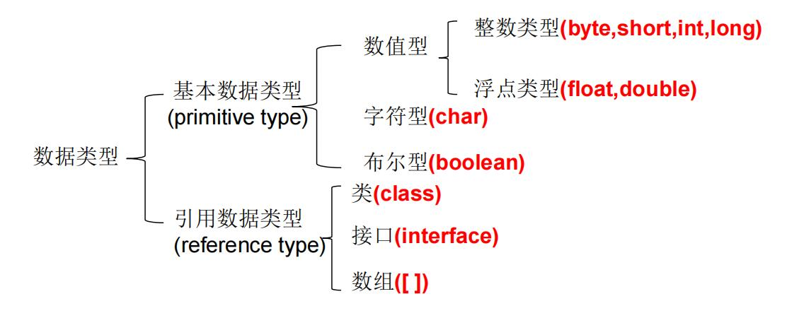

# 数据类型

java数据类型有两类，基本数据类型和引用数据类型。其中基本数据类型分为三种：数值型、字符型、布尔型，数值型又有整型和浮点型的区分。

### 基本数据类型

#### 整型

整型用于表示没有小数部分的数值，它允许是负数。Java提供了4种整型

| 类型  | 存储长度 | 范围           |
| ----- | -------- | -------------- |
| byte  | 1字节    | -128~127       |
| short | 2字节    | -2^15^~2^15^-1 |
| int   | 4字节    | -2^31^~2^31^-1 |
| long  | 8字节    | -2^63^~2^63^-1 |

java的整型数值默认为 int 型，声明long型数值须后加‘l’或‘L’

java程序中变量通常声明为int型，除非不足以表示较大的数，才使用long

* 字面量值

  二进制数值以0b/B开头(java7)，八进制以0开头，十六进制以0x/X开头

> Java各整数类型有固定的表数范围和字段长度，不受具体OS的影响，以保证java程序的可移植性。
>
> 从Java 7开始，还可以为数字字面量加下划线

#### 浮点型

浮点类型用于表示有小数部分的数值。在Java中有两种浮点类型。

| 类型   | 存储长度 | 范围                 |
| ------ | -------- | -------------------- |
| float  | 4字节    | -3.403E38~3.403E38   |
| double | 8字节    | -1.798E308~1.798E308 |

java浮点数值默认为double类型。声明float类型的数值需要后缀F或f，也可以在double数值后面添加后缀D或d。

java程序中变量通常声明为double型，除非特定需求，才使用float

* 字面量值

  * 可以使用科学计数法形式
  * 可以使用十六进制表示浮点数值，使用p表示指数，如0x1.0p-3
  * 十进制

* IEEE 754规范

  * 溢出

    溢出包含正无穷大、负无穷大。Double.POSITIVE_INFINITY、Double.NEGATIVE_INFINITY表示这两个值。

  * 出错

    Double.NaN表示出错，得到的不是数字。计算0/0或者负数的平方根结果为NaN。NaN不自等。要判断一个数值是否为NaN需要使用Double.isNaN()方法。

#### 字符型

char 型数据用来表示通常意义上“字符”(2字节)，有些Unicode字符可以用一个char值描述，另外一些Unicode字符则需要两个char值。

在Java中，char类型描述了UTF-16编码中的一个代码单元。不要在程序中使用char类型，除非确实需要处理UTF-16代码单元。最好将字符串作为抽象数据类型处理。

* 字面量值

  * 单引号括起来的单个字符

  * 使用转义字符‘\’来将其后的字符转变为特殊字符型常量

  * 使用 Unicode 值来表示字符型常量：‘\uXXXX’。

    > Unicode转义序列会在解析代码之前得到处理。

#### 布尔类型

boolean（布尔）类型有两个值：false和true，用来判定逻辑条件。整型值和布尔值之间不能进行相互转换。

> Java虚拟机中没有任何供boolean值专用的字节码指令，Java语言表达所操作的boolean值，在编译之后都使用java虚拟机中的int数据类型来代替：true用1表示，false用0表示。

### 类型转换

#### 数值类型间转换

* 自动类型转换

  容量小的类型自动转换为容量大的数据类型。

  混合运算类型转换规则：

  * 如果两个操作数中有一个是double类型，另一个操作数就会转换为double类型。
  * 否则，如果其中一个操作数是float类型，另一个操作数将会转换为float类型。
  * 否则，如果其中一个操作数是long类型，另一个操作数将会转换为long类型。
  * 否则，两个操作数都将被转换为int类型。

* 强制类型转换

  将容量大的数据类型转换为容量小的数据类型。使用时要加上强制转换符：()，但可能造成精度降低或溢出

#### 字符串与基本数据类型的转换

字符串与基本数据类型转换需要涉及到面向对象相关知识，故在常用类的[字符串](../common_class/string.md)章节进行讲述。