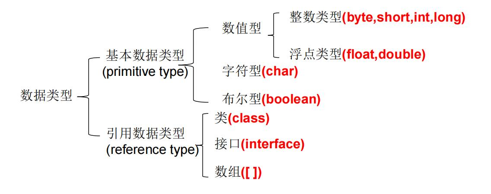

# 变量与运算符

### 标识符

Java 对各种变量、方法和类等要素命名时使用的字符序列称为标识符

* 合法标识符规则：
  1. 由26个英文字母大小写，0-9 ，_或 $ 组成

  2. 数字不可以开头。

  3. 不可以使用关键字和保留字，但能包含关键字和保留字。

     > 关键字是被Java语言赋予了特殊含义，用做专门用途的字符串。关键字所有字母小写。
     >
     > 保留字是现有Java版本尚未使用，但以后版本可能会作为关键字使用的字符串。

  4. Java中严格区分大小写，长度无限制。

* 名称命名规范

  * 包名：多单词组成时所有字母都小写：xxxyyyzzz
  * 类名、接口名：多单词组成时，所有单词的首字母大写：XxxYyyZzz
  * 变量名、方法名：多单词组成时，第一个单词首字母小写，第二个单词开始每个单词首字母大写：xxxYyyZzz
  * 常量名：所有字母都大写。多单词时每个单词用下划线连接：XXX_YYY_ZZZ

> java采用unicode字符集，因此标识符也可以使用汉字声明，但是不建议使用。

### 变量

变量是内存中的一个存储区域，该区域的数据可以在同一类型范围内不断变化，因而能够在内存中保存数据。变量是程序中最基本的存储单元，包含变量类型、变量名和存储的值。

#### 变量的使用

Java中每个变量必须先声明，后使用。变量通过`final`关键字修饰就变为常量，赋值之后不能更改。

* 变量声明

  通过“数据类型 变量名”语法声明变量。

  声明后的变量可以使用变量名来访问变量保存的数据。

* 作用域

  作用域是变量使用有效的范围。变量的作用域是其定义所在的一对{ }内。

  同一个作用域内，不能定义重名的变量

* 默认值

  如果局部变量声明后未进行初始化，该变量没有默认值，在这种情况下使用编译器会报错。

  如果成员变量声明后未初始化，会分配默认值。

#### 变量的分类

* 按数据类型不同

  java对于每一种数据都定义了明确的数据类型，在内存中分配了不同大小的内存空间。

  

* 按声明位置不同

  * 在方法体外，类体内声明的变量称为成员变量。
  * 在方法体内部声明的变量称为局部变量。 

运算符